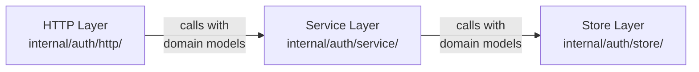

## Introduction

The BarTAB authentication service follows "clean architecture" principles with
three distinct layers that enforce separation of concerns and maintain clear 
dependency boundaries. This design ensures the codebase remains maintainable, 
testable, and adaptable as requirements evolve. Until it doesn't.

## Architectural Layers

You may notice that they all communicate using **domain models** rather than
DTOs or database models. This is a deliberate choice to ensure that each layer
remains decoupled and focused on its specific responsibilities.

This means that the **HTTP Layer** is responsible for converting incoming SDK 
DTOs (defined in `pkg/authsdk`) into domain models before passing them to the
**Service Layer**. The service layer then processes business logic using these
domain models and calls the **Store Layer** with domain models for data
persistence.

| Layer   | Location                 | Responsibility                                                    |
|---------|--------------------------|-------------------------------------------------------------------|
| HTTP    | `internal/auth/http/`    | Converts DTOs to domain models, calls services, formats responses |
| Service | `internal/auth/service/` | Business logic, OAuth2 flows, calls store with domain models      |
| Store   | `internal/auth/store/`   | Data persistence interfaces using domain models                   |

## Design Principles

### Separation of Concerns

Each layer focuses on a single responsibility:
- **HTTP layer** - Converts between DTOs and domain models, handles 
  HTTP-specific concerns
- **Service layer** - Implements business logic, orchestrates operations across 
  the store
- **Store layer** - Defines persistence interfaces, implemented by database 
  drivers

Ontop of the layers there is the following additional components:
- **Domain Models** - Defines shared data models with no dependencies on other 
  layers
- **SDK** - Provides DTOs and client library to ensure API contract consistency

### Dependency Inversion

Higher layers depend on abstractions (interfaces) defined by lower layers 
rather than concrete implementations. This allows:
- Easy testing with mock implementations
- Swapping implementations without changing business logic
- Adding new features without modifying existing code

<Callout type="info" title="Note">
    I say they can be easier to test, but I haven't really written many tests 
    yet on the services. I've mainly done integration tests to verify end-to-end
    functionality. This is something I plan to improve as the codebase matures.
</Callout>

### Explicit Dependencies

The application uses **dependency injection** where dependencies are explicitly 
passed to constructors rather than using global state or service locators. This 
makes the dependency graph visible and testable.

