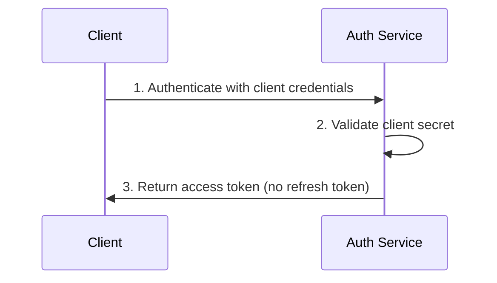

## Introduction

The Client Credentials flow enables machine-to-machine authentication where a
confidential client authenticates using its client ID and secret to obtain an
access token. No user context or refresh tokens are involved as these should be
only used for short lived actions.

## When to Use

Use this flow for:

- Backend services that need to communicate with other services
- Automated agents or bots
- Scheduled jobs or batch processes
- Microservices requiring service-to-service authentication

## Flow Sequence



## Step Details

1. **Authenticate with client credentials**: `POST /v1/oauth2/token` with 
    parameters:

   | Parameter       | Value                | Description                                                |
   |-----------------|----------------------|------------------------------------------------------------|
   | `grant_type`    | `client_credentials` | The grant type for client authentication                   |
   | `client_id`     | string               | Your service's client identifier                           |
   | `client_secret` | string               | Your service's client secret                               |
   | `scope`         | string               | Requested permissions (e.g., `service:read service:write`) |

2. **Validate client secret**: Auth service verifies the client ID and secret
    match a registered confidential client.

3. **Return access token**: Auth service responds with:
   ```json
   {
     "access_token": "eyJhbGc...",
     "token_type": "Bearer",
     "expires_in": 3600,
     "scope": "service:read service:write"
   }
   ```

    <Callout title="Note" >
        No refresh token is issued for client credentials flow.
    </Callout>

## Implementation Example

```go
package main
    
import (
    "context"
    "fmt"

    "github.com/aussiebroadwan/bartab/pkg/authsdk"
)

const (
    authServiceURL = "https://auth.bartab.example.com"

    clientID       = "your_service_client_id"
    clientSecret   = "your_service_client_secret"
    scopes         = "service:read service:write"
)

func main() {
    // Initialize the auth SDK client
    client := authsdk.NewSDKClient(authServiceURL)

    // Authenticate using client credentials grant
    resp, err := client.ClientCredentialsGrant(
        context.Background(), 
        clientID,
        clientSecret, 
        scopes,
    )
    if err != nil {
        log.Fatalf("Authentication failed: %v", err)
    }

    // Create a session for the service using the obtained access token
    session := client.NewSessionFromTokens(clientID, resp.AccessToken, "", resp.Scope, resp.ExpiresIn)
    fmt.Printf("Authenticated successfully! Client session created.\n")
    fmt.Printf("Access Token: %s\n", session.AccessToken())
}
```

## Security Considerations

Client secrets must be stored securely and never committed to version control.
Use environment variables or secret management systems.

Access tokens issued via client credentials have no refresh tokens. Services
must request new tokens when the current token expires. Implement proper token
caching to avoid excessive token requests.

Scope the client credentials as narrowly as possible. Each service should only
have access to the resources it needs to function.

## Related Topics

- [Authorization Code with PKCE](/docs/auth/flows/pkce) - Interactive user authentication
- [Refresh Token Flow](/docs/auth/flows/refresh) - Renewing access tokens
- [Token Validation](/docs/auth/flows#token-validation) - Validating JWTs in your services
- [Error Handling](/docs/auth/flows#error-handling) - Common OAuth2 errors
