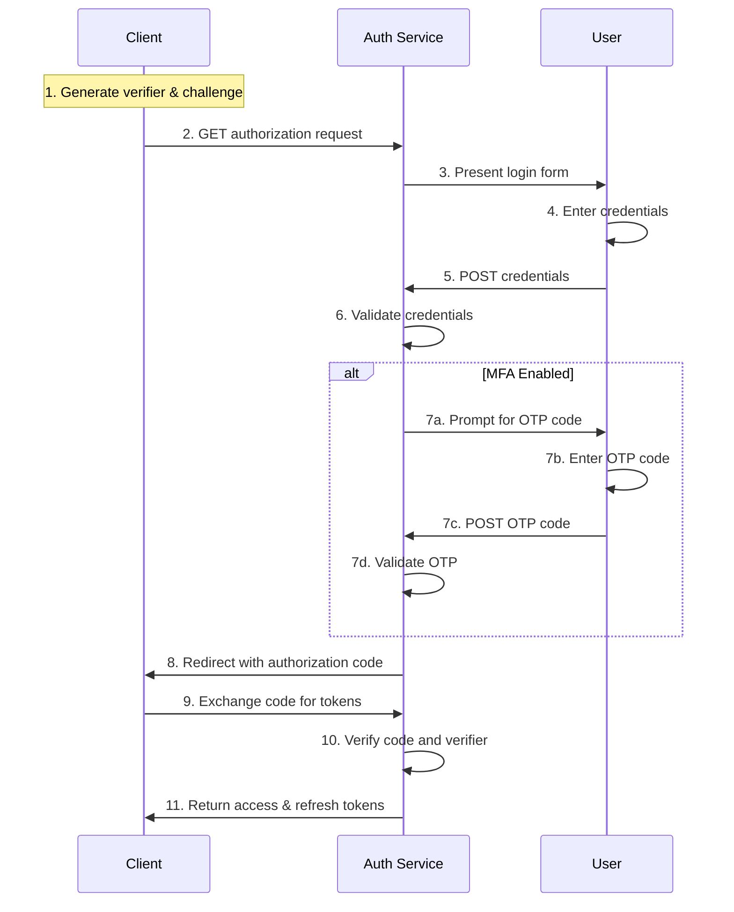

## Introduction

The Authorization Code flow with Proof Key for Code Exchange (PKCE) is the
recommended approach for authenticating users in web, CLI, and mobile
applications. PKCE protects against authorization code interception attacks by
requiring the client to prove it initiated the authorization request.

<Callout title="Note" >
    If the user has multi-factor authentication (MFA) enabled, the auth service
    will prompt for an OTP code during the authorization process before issuing
    the authorization code.
</Callout>

## When to Use

Use this flow when you need interactive user authentication in:

- Single-page applications (SPAs) running in the browser
- Command-line tools that can open a browser window
- Desktop applications with embedded browsers
- Mobile applications on iOS or Android

## Flow Sequence

The flow consists of two main phases: authorization and token exchange.



## Step Details

1. **Generate PKCE parameters**: Client creates a random code verifier (32-byte 
    random string) and derives a SHA256 code challenge from it.

2. **Authorization request**: `GET /v1/oauth2/authorize` with parameters:

   | Parameter               | Value  | Description                                           |
   |-------------------------|--------|-------------------------------------------------------|
   | `response_type`         | `code` | Request an authorization code                         |
   | `client_id`             | string | Your OAuth2 client identifier                         |
   | `redirect_uri`          | string | Where to send the user after authentication           |
   | `code_challenge`        | string | SHA256 hash of the code verifier                      |
   | `code_challenge_method` | `S256` | PKCE challenge method                                 |
   | `scope`                 | string | Requested permissions (e.g., `openid profile email`)  |
   | `state`                 | string | Random value to prevent CSRF attacks                  |

3. **Present login form**: Auth service returns an HTML login form (or 
    redirects to a hosted login page).

4. **Enter credentials**: User fills in their username and password in the 
    login form.

5. **Submit credentials**: `POST /v1/oauth2/authorize` with form data:

   | Parameter  | Description                      |
   |------------|----------------------------------|
   | ...        | Parameter Values from **Step 2** |
   | `username` | User's username or email         |
   | `password` | User's password                  |

6. **Validate credentials**: Auth service verifies the credentials and checks 
    if MFA is enabled for the account.
   - If credentials are valid and **MFA is NOT enabled**: Returns `302` redirect to `redirect_uri?code=...` (skip to step 8)
   - If credentials are valid and **MFA IS enabled**: Returns `409 Conflict` with an HTML form requesting the OTP code

7. **MFA Challenge (if enabled)**: If the user has MFA enabled on their account:
   - **7a. Receive MFA prompt**: Auth service returns `409 Conflict` with an 
        HTML form requesting the OTP code
   - **7b. Enter OTP code**: User enters the 6-digit time-based code from their 
        authenticator app or a single-use backup code
   - **7c. Submit OTP**: `POST /v1/oauth2/authorize` with form data:

     | Parameter  | Description                      |
     |------------|----------------------------------|
     | ...        | Parameter Values from **Step 5** |
     | `otp_code` | The 6-digit OTP code             |

   - **7d. Validate OTP**: Auth service verifies the OTP code is valid, not 
    expired, and matches the user's registered MFA secret

8. **Redirect with authorization code**: Auth service returns `302` redirect 
    to `redirect_uri?code=...` with a single-use authorization code. 
    If MFA was completed, the eventual access token will include `mfa` in the 
   **AMR claim.**

9. **Exchange code for tokens**: `POST /v1/oauth2/token` with parameters:

   | Parameter       | Value                | Description                         |
   |-----------------|----------------------|-------------------------------------|
   | `grant_type`    | `authorization_code` | The grant type for code exchange    |
   | `code`          | string               | The authorization code from step 8  |
   | `redirect_uri`  | string               | Must match the value from step 2    |
   | `client_id`.    | string               | Your OAuth2 client identifier       |
   | `code_verifier` | string               | The original verifier from step 1   |

10. **Verify code and verifier**: Auth service validates that the code is 
    valid, not expired, and that the verifier matches the challenge from 
   **step 2**.

11. **Return tokens**: Auth service responds with:
    ```json
    {
      "access_token": "eyJhbGc...",
      "token_type": "Bearer",
      "expires_in": 3600,
      "refresh_token": "rt_01HQXYZ...",
      "scope": "openid profile email"
    }
    ```
    If MFA was completed during authorization, the access token's claims will 
    include `"amr": ["pwd", "mfa"]`.

## Implementation Example

From the client's perspective, MFA is handled transparently within the
authorization UI. The client code is identical whether the user has MFA enabled
or not. For server-side applications that can securely collect credentials, you 
can use the direct password flow. This approach handles MFA programmatically if
required.

```go
package main

import (
    "context"
    "errors"
    "fmt"
    "log"

    "github.com/aussiebroadwan/bartab/pkg/authsdk"
)

const (
    authServiceURL = "https://auth.example.com"

    clientID    = "your-client-id"
    redirectURI = "http://localhost:8080/callback"
    scopes      = "openid profile:read"
)

func authenticateUser(ctx context.Context, username, password string) (*authsdk.Session, error) {
    client := authsdk.NewSDKClient(authServiceURL)

    // Attempt authorization with username and password
    // This uses a built-in no redirect http client.
    session, err := client.AuthorizeAndExchange(
        ctx,
        clientID,
        "", // No client secret for public clients
        redirectURI,
        username,
        password,
        scopes,
    )
    if err != nil {
        // Check if MFA is required
        var mfaErr *authsdk.MFARequiredError
        if errors.As(err, &mfaErr) {
            // Prompt user for MFA code
            otpCode := promptForMFACode() // Implement this based on your UI

            // Complete authentication with MFA
            session, err = client.AuthorizeAndExchangeWithMFA(
                ctx,
                clientID,
                "", // No client secret for public clients
                redirectURI,
                *mfaErr,
                "totp", // or "backup_code"
                otpCode,
                scopes,
            )
            if err != nil {
                return nil, fmt.Errorf("MFA verification failed: %w", err)
            }

            return session, nil
        }

        return nil, fmt.Errorf("authentication failed: %w", err)
    }

    return session, nil
}

func promptForMFACode() string {
    // Implement based on your application (CLI prompt, form input, etc.)
    var code string
    fmt.Print("Enter your 6-digit MFA code: ")
    fmt.Scanln(&code)
    return code
}

func main() {
    session, err := authenticateUser(context.Background(), "alice", "password123")
    if err != nil {
        log.Fatalf("Authentication failed: %v", err)
    }

    fmt.Printf("Authenticated successfully! User session created.\n")
    // Use session for authenticated API calls...
}
```

## Authentication Method References (AMR)

When MFA is successfully completed during authorization, the issued access
token will include `mfa` in the Authentication Method References (AMR) claim.
Downstream services can inspect this claim to enforce MFA requirements for
sensitive operations.

**Token with MFA completed:**
```json
{
  "sub": "user_01HQXYZ...",
  "amr": ["pwd", "mfa"],
  "scope": "openid profile email",
  "iss": "https://auth.bartab.example.com",
  ...
}
```

**Token without MFA (user doesn't have MFA enabled):**
```json
{
  "sub": "user_01HQXYZ...",
  "amr": ["pwd"],
  "scope": "openid profile email",
  "iss": "https://auth.bartab.example.com",
  ...
}
```

Services can check for the MFA claim to enforce additional security:

```go
func requireMFA(claims *authsdk.TokenClaims) error {
    for _, amr := range claims.AMR {
        if amr == "mfa" {
            return nil
        }
    }
    return fmt.Errorf("this operation requires MFA authentication")
}
```

## Response Behavior

The `POST /v1/oauth2/authorize` endpoint has different response behaviors 
depending on the authentication state:

| Condition                          | HTTP Status       | Response                                      |
|------------------------------------|-------------------|-----------------------------------------------|
| Credentials valid, MFA not enabled | `302 Found`       | Redirect to `redirect_uri?code=...` |
| Credentials valid, MFA enabled     | `409 Conflict`    | HTML form requesting OTP code                 |
| Credentials invalid                | `400 Bad Request` | Error message or HTML form with error         |
| OTP code valid (after MFA)         | `302 Found`       | Redirect to `redirect_uri?code=...` |
| OTP code invalid                   | `400 Bad Request` | HTML form with error message                  |

<Callout title="Note" >
    The `409 Conflict` status code signals to the client (or user's browser) that 
    additional authentication is required before the authorization can complete.
</Callout>

## Security Considerations

The authorization code is single-use and expires after 10 minutes if not
exchanged. Store the code verifier securely and never transmit it in URLs or 
logs. The verifier must match the challenge exactly for the token exchange to 
succeed.

When MFA is enabled, the challenge happens within the authorization UI as part
of the interactive flow. The session state is maintained server-side and never
exposed to the client, preventing session fixation or replay attacks.

OTP codes are time-based with a 30-second window and allow one step of clock
skew for validation. Failed OTP attempts are rate-limited to prevent brute
force attacks.

Backup codes are single-use and immediately invalidated upon successful
authentication. Users should be prompted to generate new backup codes when
they run low.

## Related Topics

- [Client Credentials Flow](/docs/auth/flows/client) - Machine-to-machine authentication
- [Refresh Token Flow](/docs/auth/flows/refresh) - Renewing access tokens
- [Token Validation](/docs/auth/flows#token-validation) - Validating JWTs in your services
- [Error Handling](/docs/auth/flows#error-handling) - Common OAuth2 errors
