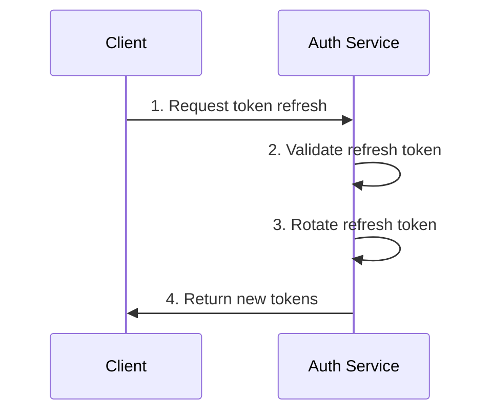

## Overview

The refresh token flow allows clients to obtain new access tokens without
requiring the user to re-authenticate. Each refresh operation rotates the
refresh token, invalidating the previous one to prevent replay attacks.

<Callout title="Note" >
    Only Authorization Code with PKCE flow issues refresh tokens. Client 
    Credentials flow does not use refresh tokens.
</Callout>

## When to Use

Use refresh tokens to:

- Keep users logged in without interrupting their session
- Increase or decrease token scopes dynamically
- Maintain long-lived sessions in mobile or desktop applications
- Reduce the frequency of interactive authentication

## Flow Sequence



## Step Details

1. **Request token refresh**: `POST /v1/oauth2/token` with parameters:

   | Parameter       | Value           | Description                      |
   |-----------------|-----------------|----------------------------------|
   | `grant_type`    | `refresh_token` | The grant type for token refresh |
   | `refresh_token` | string          | The current refresh token        |
   | `client_id`     | string          | Your OAuth2 client identifier    |

2. **Validate refresh token**: Auth service verifies the refresh token is 
    valid, not expired, and not revoked.

3. **Rotate refresh token**: Auth service generates a new refresh token and 
    invalidates the old one to prevent replay attacks.

4. **Return new tokens**: Auth service responds with:
   ```json
   {
     "access_token": "eyJhbGc...", // NEW Access Token
     "token_type": "Bearer",
     "expires_in": 3600,
     "refresh_token": "rt_01HQABC...",  // NEW Refresh Token
     "scope": "openid profile email"
   }
   ```

## Implementation Example

```go
package main

import (
    "context"
    "errors"
    "fmt"
    "log"

    "github.com/aussiebroadwan/bartab/pkg/authsdk"
)

const (
    authServiceURL = "https://auth.example.com"

    clientID    = "your-client-id"
    redirectURI = "http://localhost:8080/callback"
    scopes      = "openid profile:read"
)

func authenticateUser(ctx context.Context, username, password string) (*authsdk.Session, error) {
    client := authsdk.NewSDKClient(authServiceURL)

    // Attempt authorization with username and password
    session, err := client.AuthorizeAndExchange(
        ctx,
        clientID,
        "", // No client secret for public clients
        redirectURI,
        username,
        password,
        scopes,
    )
    if err != nil {
        return nil, fmt.Errorf("failed to authenticate user: %w", err)
    }

    // Assume there is no MFA and this is fine
    return session, nil
}

func main() {
    session, err := authenticateUser(context.Background(), "alice", "password123")
    if err != nil {
        log.Fatalf("Authentication failed: %v", err)
    }

    fmt.Printf("Authenticated successfully! User session created.\n")
    fmt.Printf("Access Token: %s\n", session.AccessToken())

    // Process stuff with session...
    // Oh no - token expired! Need to refresh.
   
    // Refresh token
    resp, err := client.RefreshGrant(context.Background(), clientID, session.RefreshToken())
    if err != nil {
        log.Fatalf("Failed to refresh token: %v", err)
    }

    // Update session with new tokens
    session = client.NewSessionFromTokens(clientID, resp.AccessToken, resp.RefreshToken, resp.Scope, resp.ExpiresIn)
    fmt.Printf("Token refreshed successfully! New access token: %s\n", session.AccessToken())
}
```

## Token Rotation

Each successful refresh operation issues a new refresh token and invalidates
the previous one. Clients must store the new refresh token immediately and use
it for subsequent refresh operations.

If a refresh token is used more than once, the auth service will detect the
replay attempt and revoke the entire token family, terminating the session.
This protects against token theft and replay attacks.

## Security Considerations

Store refresh tokens securely using platform-specific secure storage:

- **Web browsers**: Use httpOnly, secure cookies with SameSite protection
- **Mobile apps**: Use iOS Keychain or Android Keystore
- **Desktop apps**: Use platform credential managers or encrypted storage

Never expose refresh tokens in URLs, logs, or analytics. They are long-lived
credentials that grant continued access to user accounts.

Implement proper error handling for refresh failures. If a refresh fails due
to token revocation or expiration, redirect the user to re-authenticate rather
than retrying indefinitely.

## Related Topics

- [Authorization Code with PKCE](/docs/auth/flows/pkce) - Interactive user authentication
- [Client Credentials Flow](/docs/auth/flows/client) - Machine-to-machine authentication
- [Token Validation](/docs/auth/flows#token-validation) - Validating JWTs in your services
- [Error Handling](/docs/auth/flows#error-handling) - Common OAuth2 errors
