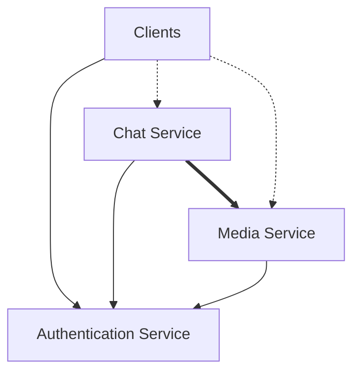
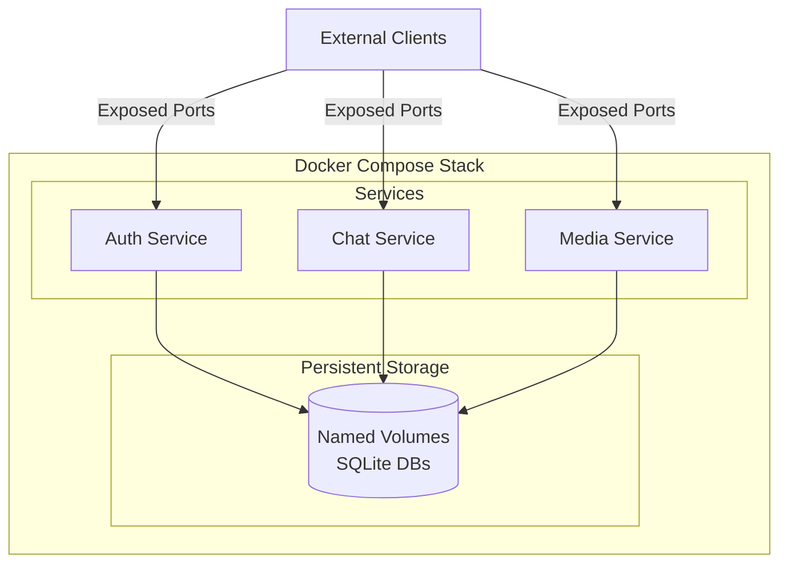

import { Callout } from 'fumadocs-ui/components/callout';

<Callout type="warn" title="Design In Progress">
  This architecture is based roughly on the [Matrix protocol](https://spec.matrix.org/)
  but is not finalized. Design decisions around service structure, event delivery,
  and communication patterns are subject to change until we reach version 1.0.
  Expect iterations as we validate assumptions and optimize for our use cases.
</Callout>

## Overview

BarTAB is built as a collection of microservices, each handling a distinct 
domain of responsibility. This separation allows services to scale 
independently, maintain clear API boundaries, and evolve without tightly
coupled dependencies.

While microservices are often overkill for small projects, our design justifies
this approach for several reasons:

- **Independent scaling**: Media handling may need different resources than chat
  message processing.
- **Clear separation of concerns**: Auth, chat, and media are fundamentally
  different domains with different consistency requirements.
- **Multi-tenant potential**: Shared auth or media services across multiple
  chat instances for testing environments maybe.
- **Development isolation**: Teams can work on different services with minimal
  coordination overhead, if I end up convincing people to help work on this.

## Service Dependency Graph

The three core services have a clear dependency hierarchy:

**Key points:**

- **Authentication Service** is the root dependency. Without it running, no
  other service can validate tokens or authorize requests.
- **Chat Service** and **Media Service** are peers that both depend on Auth but
  not on each other (though Chat references Media URLs in messages).
- **Clients** authenticate via Auth, then communicate with Chat and Media using
  the issued tokens.

## Write-Ahead Log (WAL) Design

The Chat Service is built around a **write-ahead log** of immutable events.
Every action—message sends, room joins, reactions, state changes—is represented
as a discrete event with a unique ULID identifier.

### Why Write-Ahead Log?

- **Deterministic ordering**: Events are sorted lexicographically by ULID,
  providing a total order without coordination.
- **Immutability**: Once written, events cannot be changed, eliminating entire
  classes of race conditions and state bugs.
- **Replayability**: Event streams can be replayed to reconstruct state or
  debug issues.
- **Federation-ready**: WAL is a prerequisite for eventual federation patterns,
  where servers need to agree on event ordering.

### Event Structure

Each event follows this schema roughly, this is still a work in progress and
will be updated:

| Field       | Type     | Description                     | Example                      |
|-------------|----------|---------------------------------|------------------------------|
| `event_id`  | ULID     | Unique identifier for the event | `01HZX1WNYVK2T69GPKJZV8Q5E3` |
| `type`      | String   | Event type                      | `m.room.message`             |
| `sender`    | ULID     | User who created the event      | `01HZX1WNYVK2T69GPKJZV8Q5E3` |
| `room_id`   | ULID     | Room where the event occurred   | `01HZX1WNYVK2T69GPKJZV8Q5E3` |
| `timestamp` | ISO 8601 | When the event was created      | `2025-10-07T00:00:00Z`       |
| `content`   | Object   | Event-specific payload          | Varies by event type         |

See [Events](/docs/design/events) for detailed event type specifications.

## Real-Time Event Delivery: Long Polling vs SSE

We're evaluating two approaches for real-time event delivery: **Long Polling**
and **Server-Sent Events (SSE)**. Both have distinct tradeoffs that affect
operational complexity and reliability. WebSockets are explicitly out of scope
due to their requirement for sticky sessions and connection management overhead.

### Comparison

| Aspect                  | Long Polling                    | Server-Sent Events                 |
|-------------------------|---------------------------------|------------------------------------|
| **Connection Model**    | Request-response cycle          | Persistent unidirectional stream   |
| **Connection Recovery** | Automatic via retry loop        | Requires reconnection logic        |
| **Timeout Behavior**    | Guaranteed completion           | Can be silently dropped by proxies |
| **Event Batching**      | Natural per-request batching    | One event at a time                |
| **Pod Failover**        | Requests fail and retry cleanly | Requires reconnection handling     |

### Long Polling Advantages

- **Predictable timeouts**: Each request completes within the specified window
- **Automatic recovery**: Connection drops are handled by natural retry behavior
- **Event batching**: Multiple events can be delivered per request
- **Simple deployment**: No special connection draining during updates

### SSE Advantages

- **Lower latency**: Events pushed immediately without request overhead
- **Built-in reconnection**: EventSource API handles reconnection automatically
- **Standardized protocol**: Native browser support with retry semantics
- **Efficient for high-frequency updates**: No request/response overhead

### Outstanding Questions

- **Proxy behavior**: Will SSE connections be stable through our deployment
  infrastructure (load balancers, reverse proxies)?
- **Connection limits**: How do browser connection limits affect multi-tab 
  usage with SSE?
- **Latency requirements**: Is the additional round-trip latency of long
  polling acceptable for the user experience?

We'll make a final decision based on infrastructure testing and performance
profiling with realistic workloads.

## Service Communication

Services communicate via standard HTTP/REST APIs with JWT bearer tokens for
authentication. Each service exposes:

- **Health endpoints**: `/healthz` (liveness), `/readyz` (readiness)
- **Discovery endpoints**: `/.well-known` (capabilities, limits, configuration)
- **Versioned APIs**: `/v1/...` for stable endpoints

### JWT Validation

Chat and Media services validate JWTs using the public keys exposed by the Auth
Service at `/.well-known/jwks.json`. This follows RFC 7517 (JWKS) and RFC 7518
(JWA) standards, supporting RS256, ES256, and EdDSA signature algorithms.

Benefits of JWKS-based validation:

- **No shared secrets**: Services don't need to store or rotate shared keys
- **Cacheable**: JWKS responses can be cached with standard HTTP cache headers
- **Standard**: Off-the-shelf JWT libraries can validate tokens without custom
  integration

## Deployment Architecture

For MVP, all services run as Docker containers orchestrated by Docker Compose:

Services communicate over an internal Docker network, with only necessary ports
exposed to the host for external access. SQLite databases are stored in named
volumes for persistence across container restarts.

## Scalability Considerations

While the MVP is designed for single-instance deployment, the architecture
supports horizontal scaling:

- **Stateless services**: Auth, Chat, and Media can run multiple replicas
  behind a load balancer
- **Shared state**: SQLite will need to be replaced with PostgreSQL or another
  multi-writer database
- **Media storage**: Local filesystem storage can be replaced with S3 or
  compatible object storage

These transitions are straightforward because the service interfaces are
already designed with distribution in mind.
